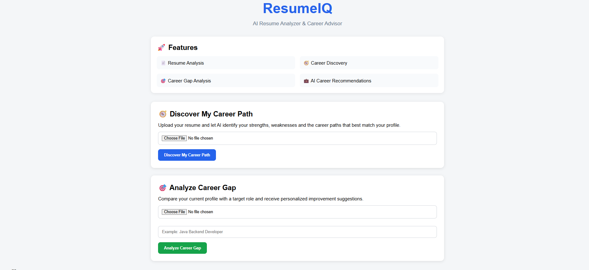
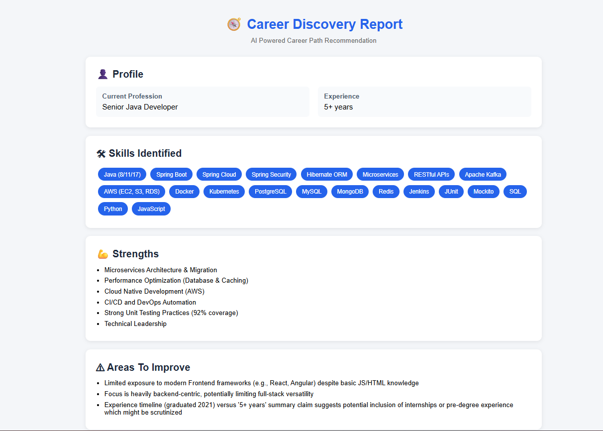
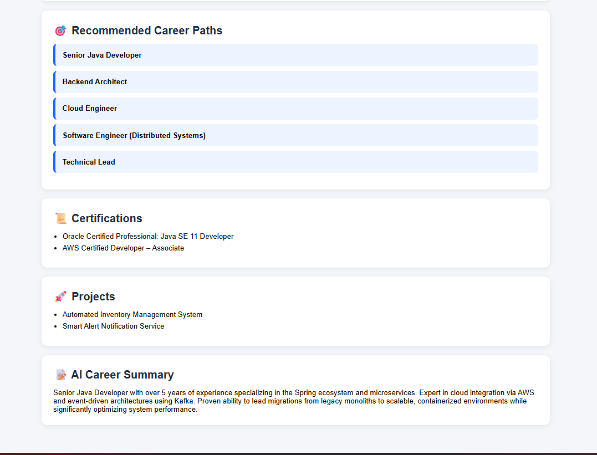
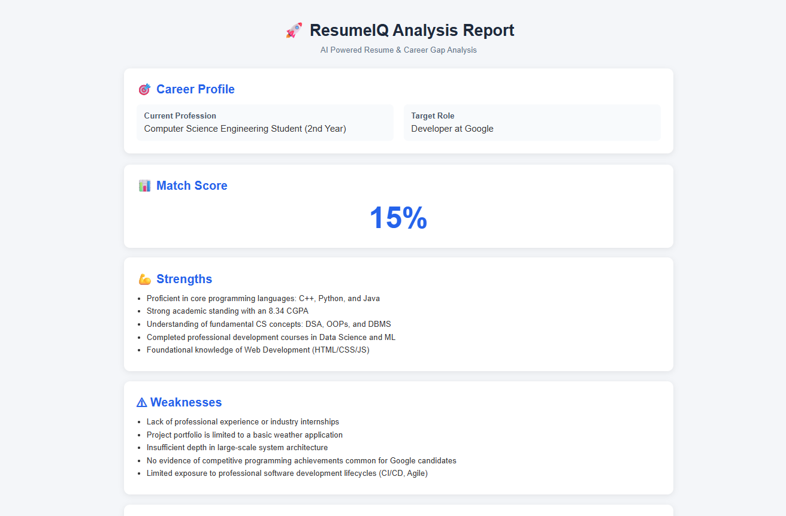
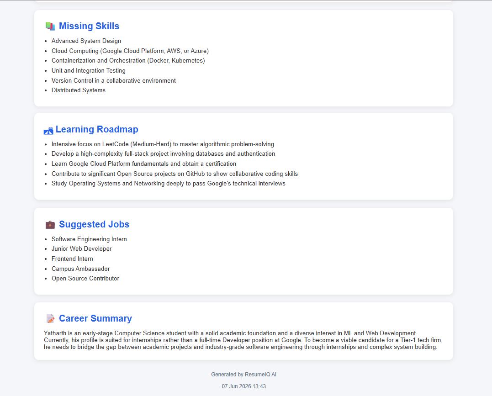

# ResumeIQ 🚀

AI-Powered Resume Analyzer and Career Advisor built using Spring Boot, Thymeleaf, Apache PDFBox, and Google Gemini AI.

ResumeIQ helps users analyze their resumes, discover suitable career paths, identify skill gaps, and generate personalized learning roadmaps using Generative AI.

🌐 Live Demo: https://resumeiq-ry6i.onrender.com
---

## ✨ Features

### 📄 Career Discovery
- Upload a PDF resume
- AI extracts and analyzes resume content
- Identifies strengths and weaknesses
- Recommends suitable career paths
- Generates a professional career summary

### 🎯 Career Gap Analysis
- Compare your profile against a target role
- Calculate match score
- Identify missing skills
- Generate a personalized learning roadmap
- Suggest relevant job opportunities

### ⚡ User Experience
- Clean and responsive UI
- PDF-only upload support
- Loading screen during AI processing
- Friendly error handling
- Real-time AI-powered insights

---

## 🛠 Tech Stack

### Backend
- Java 25
- Spring Boot
- Maven

### Frontend
- HTML5
- CSS3
- Thymeleaf

### AI Integration
- Google Gemini API

### PDF Processing
- Apache PDFBox

### Tools
- Git
- GitHub
- Postman
- VS Code

---

## 🏗 System Architecture

```text
User Uploads Resume
        ↓
Spring Boot Controller
        ↓
Apache PDFBox
(Extract Resume Text)
        ↓
Gemini AI Analysis
        ↓
Response Mapping
        ↓
Thymeleaf UI Rendering
        ↓
Career Report Displayed
```

---

## 📸 Screenshots

### 🏠 Home Page



### 🧭 Career Discovery Report





### 🎯 Career Gap Analysis Report




---

## 📂 Project Structure

```text
resume-analyzer
│
├── src
│   ├── main
│   │   ├── java
│   │   │   └── com.toshan.resume_analyzer
│   │   │       ├── model
│   │   │       ├── service
│   │   │       ├── HelloController
│   │   │       ├── WebController
│   │   │       └── GlobalExceptionHandler
│   │   │
│   │   └── resources
│   │       ├── static
│   │       │   └── index.html
│   │       │
│   │       └── templates
│   │           ├── career-discovery.html
│   │           ├── result.html
│   │           └── error.html
│   │
│   └── test
│
├── pom.xml
└── README.md
```

---

## 🚀 Installation & Setup

Clone the repository:

```bash
git clone https://github.com/toshanarora/resume-analyzer.git
```

Move into the project:

```bash
cd resume-analyzer
```

Configure Gemini API Key:

```properties
gemini.api.key=${GEMINI_API_KEY}
```

Run the application:

```bash
mvn spring-boot:run
```

Open:

```text
http://localhost:8080
```

---

## 🧪 API Testing

ResumeIQ APIs can be tested using Postman.

### Career Discovery

```http
POST /analyze-ai
```

### Career Gap Analysis

```http
POST /career-gap
```

Both endpoints accept PDF resume uploads using `multipart/form-data`.

---

## 🔮 Future Enhancements

- ATS Resume Score
- Resume Improvement Suggestions
- Downloadable PDF Reports
- User Authentication
- Resume History Tracking
- Multi-Model AI Support
- Dashboard Analytics

---

## 👨‍💻 Author

**Toshan Arora**

GitHub:
https://github.com/toshanarora

LinkedIn:
(Add your LinkedIn profile here)

---

## ⭐ Support

If you found this project useful, consider giving it a star on GitHub.